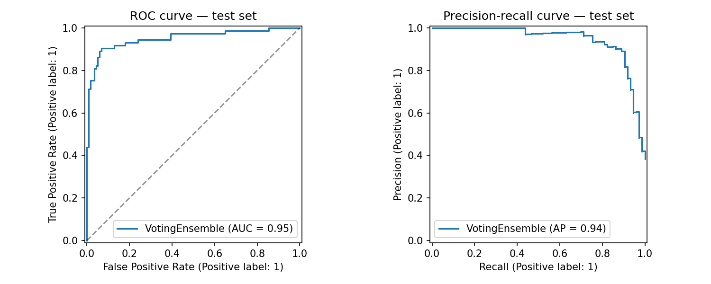
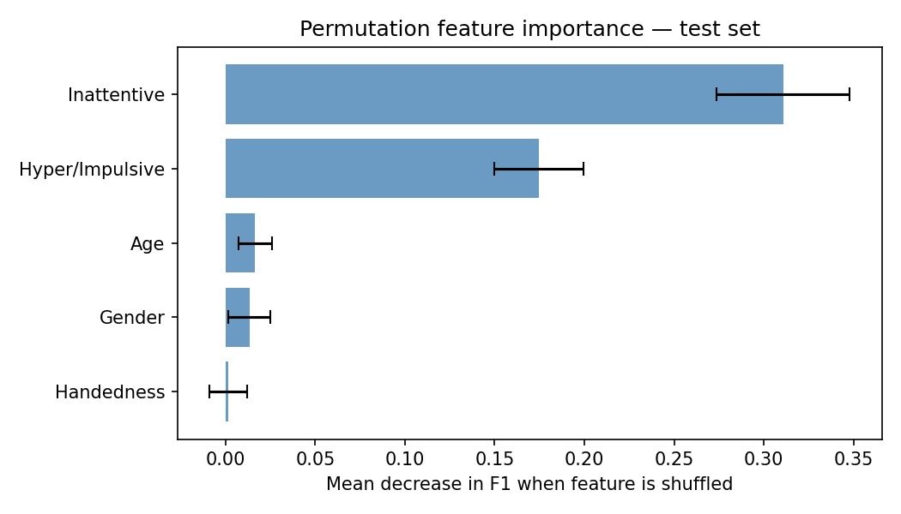

# NeuroNova

> **Live demo:** [neuronova-alpha.vercel.app](https://neuronova-alpha.vercel.app)

A web-based ADHD screening tool that predicts likelihood of ADHD referral using only
information available before any clinical assessment. Built for school counsellors, GPs,
and parents, not clinicians. The output is always a referral recommendation, never a diagnosis.

The core motivation is equity: girls and younger children are chronically underdiagnosed
with ADHD. By surfacing risk earlier, referrals can happen faster and more fairly.

---

## Results

| Metric | Score |
|---|---|
| F1 | 0.881 |
| ROC-AUC | 0.951 |
| Accuracy | 0.91 |
| Precision (ADHD) | 0.90 |
| Recall (ADHD) | 0.86 |



**Fairness audit**

| Group | N | ADHD % | F1 | ROC-AUC |
|---|---|---|---|---|
| Male | 72 | 22.2% | 0.867 | 0.916 |
| Female | 118 | 48.3% | 0.885 | 0.947 |
| Age < 10 | 66 | 48.5% | 0.936 | 0.984 |
| Age 10-13 | 75 | 36.0% | 0.909 | 0.965 |
| Age 14+ | 49 | 28.6% | 0.692 | 0.888 |

No meaningful sex bias detected. Adolescent (14+) performance is weaker, a known limitation
documented in the UI and API response.

---

## Model

Soft voting ensemble of three individually calibrated pipelines:

- `CalibratedClassifierCV(RandomForestClassifier, method='sigmoid', cv=5)`
- `CalibratedClassifierCV(ExtraTreesClassifier, method='sigmoid', cv=5)`
- `CalibratedClassifierCV(SVC(kernel='rbf'), method='sigmoid', cv=5)`

Each pipeline includes a `ColumnTransformer` preprocessor (median imputation + standard
scaling for numerics, one-hot encoding for handedness). Calibration is applied per
sub-estimator before ensembling. Wrapping the `VotingClassifier` itself would strip the
preprocessors and break inference on string inputs.

`GridSearchCV` used `PredefinedSplit` so the validation fold is identical across all models,
making F1 scores directly comparable. `class_weight='balanced'` on all estimators.

XGBoost was evaluated and dropped as it overfits aggressively on 700 samples and 6 features.
SHAP was replaced with permutation importance, which is compatible with `VotingClassifier`.

---

## Dataset

[ADHD-200 phenotypic dataset](http://fcon_1000.projects.nitrc.org/indi/adhd200/) - 973
participants, multi-site research data. After dropping 26 pending diagnoses: **947 rows**,
38.2% ADHD / 61.8% control.

**Features used** — only information available before clinical assessment:

| Feature | Detail |
|---|---|
| Age | Child's age at screening |
| Sex | Male / Female |
| Handedness | Left / Right / Mixed (cleaned from EHI floats + site-specific codes) |
| Inattentive score | Conners T-score (9-90), mapped from raw form sum (0-12) |
| Hyper/Impulsive score | Conners T-score (9-90), mapped from raw form sum (0-12) |

IQ, medication status, formal clinical scores, and secondary diagnoses were all excluded.
These require clinical input and would not be available at the point of referral.

The form collects raw item sums (4 questions x 0-3). The API maps these to T-scores before
passing to the model: `T = 9 + (raw / 12) * 81`.

**Permutation importance:**

| Feature | Importance |
|---|---|
| Inattentive | 0.311 +/- 0.037 |
| Hyper/Impulsive | 0.175 +/- 0.025 |
| Age | 0.017 +/- 0.009 |
| Sex | 0.013 +/- 0.012 |
| Handedness | 0.002 +/- 0.011 |



---

## Stack

**Backend:** FastAPI · scikit-learn · joblib · uvicorn · Pydantic

**Frontend:** React · Vite · recharts · CSS Modules · react-router-dom · axios

**Tooling:** uv · ruff · pytest

---

## Project structure

```
neuronova/
├── app/
│   ├── main.py          # FastAPI app, /predict and /health endpoints
│   └── schema.py        # Pydantic models, raw to T-score mapping
├── src/neuronova/
│   ├── data.py          # feature audit, target binarisation, train/val/test split
│   ├── features.py      # ColumnTransformer preprocessor
│   ├── train.py         # model training, GridSearchCV, calibration, ensemble
│   └── evaluate.py      # test metrics, fairness audit, permutation importance
├── models/
│   ├── model.joblib     # trained VotingEnsemble
│   └── meta.joblib      # model name + feature list
├── data/processed/      # train.csv, val.csv, test.csv
├── reports/             # confusion matrix, ROC/PR curves, calibration plot,
│                        # feature importance, audit report
└── web/                 # React frontend
    └── src/
        ├── components/  # Nav, ScoreQuestion, RiskResult
        └── pages/       # ScreeningForm, AuditDashboard, Methodology
```

---

## Running locally

Create a `.env` file in the project root:

```
PYTHONPATH=src
```

**Backend** (terminal 1):
```bash
uv run --env-file .env uvicorn app.main:app --reload
```

**Frontend** (terminal 2):
```bash
cd web && npm run dev
```

| | URL |
|---|---|
| Frontend | http://localhost:5173 |
| Backend | http://localhost:8000 |
| API docs | http://localhost:8000/docs |

Both must be running simultaneously for the screening form to work.

---

## Known limitations

- **Adolescents (14+):** F1 drops to 0.692. Behaviour rating scales were normed on younger
  children and ADHD presentation changes with age. Results for this group should be treated
  with additional caution. A warning is surfaced in the API response and UI.
- **Dataset size:** 947 participants from a research setting is small. Predictions may not
  generalise equally to all populations, schools, or cultural contexts.
- **Self-report bias:** scores depend on the accuracy and consistency of the person
  completing the form. The same child may score differently depending on who answers.
- **Not a replacement for clinical judgement:** this tool is a decision support aid.
  Clinical judgement, context, and the full history of a child should always take precedence.

---

## Author

Built by [Adit Sawhney](https://github.com/aditsawhney)

## Disclaimer

This tool does not provide medical diagnoses. It is intended as a decision support aid
to help identify children who may benefit from a formal clinical assessment. All results
should be interpreted by a qualified professional.